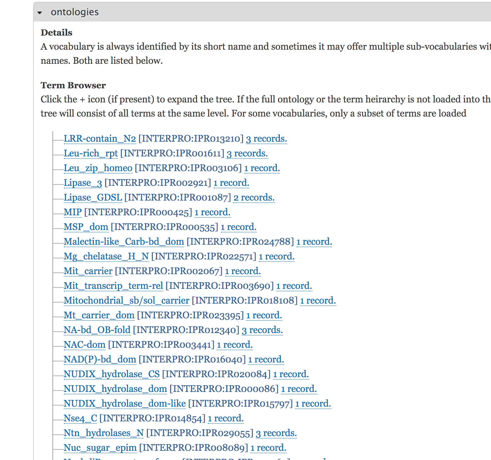
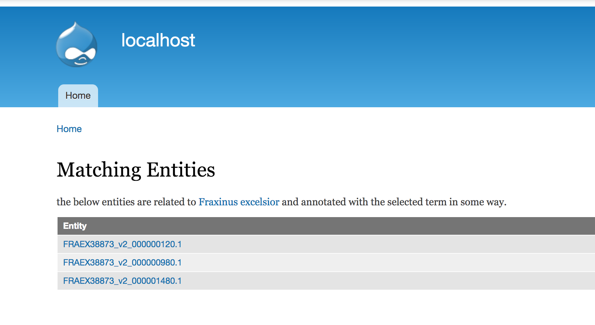

Tripal CV X-ray provides browseable CV trees with entity counts and links.  It does this by associating your entities with CVterms, and then mapping entities of one type onto another. 

# Features

* Customizable fields
* Support for Feature -> Organism mappings

>The ontology tree on an organism, showing the number of records associated with each term (and its children terms).

>Clicking on the entity record link in the tree provides the user with a browseable list of entities.

## Coming Soon

* Support for Biomaterial -> Organism mappings
* Support for Biomaterial -> Analysis mappings
* "Site wide" page

# Documentation

Coming soon